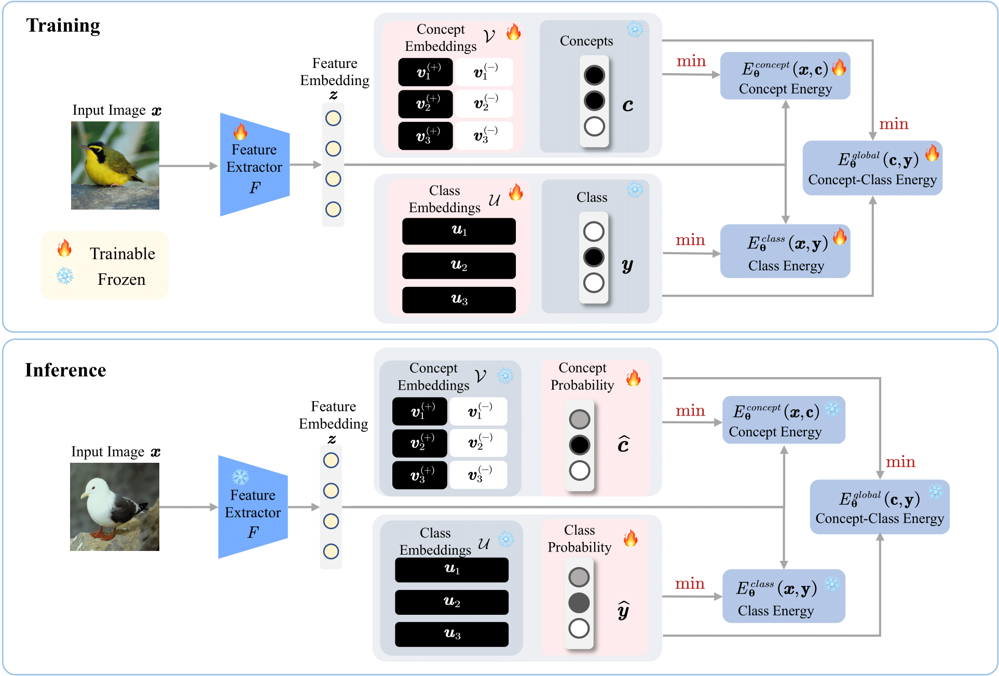
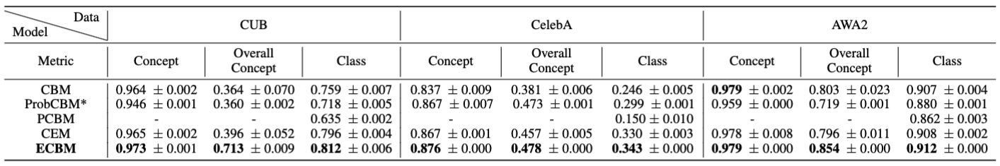
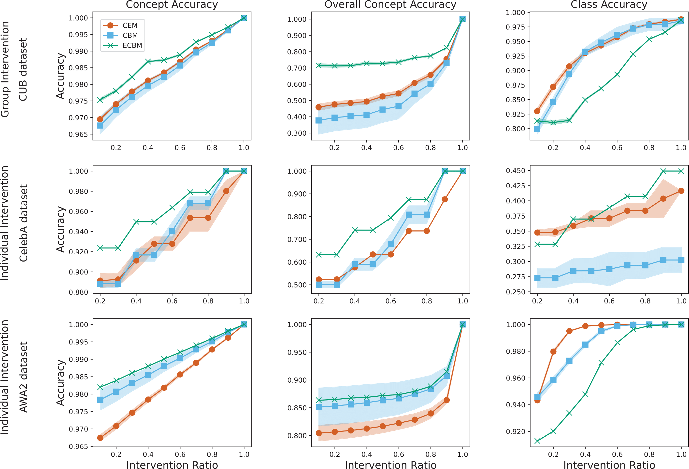
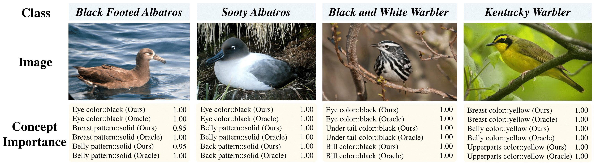

# Energy-Based Concept Bottleneck Models: Unifying Prediction, Concept Intervention, and Probabilistic Interpretations (ECBMs)
This repo is the official implementation of our ICLR 2024 paper:

[**Energy-Based Concept Bottleneck Models: Unifying Prediction, Concept Intervention, and Probabilistic Interpretations**](https://openreview.net/forum?id=I1quoTXZzc)

Xinyue Xu, Yi Qin, Lu Mi, Hao Wang, Xiaomeng Li

*Twelfth International Conference on Learning Representations (ICLR), 2024.*

[[Paper](https://arxiv.org/abs/2401.14142)] [[OpenReview](https://openreview.net/forum?id=I1quoTXZzc))] [[PPT]()]

## Overview of our ECBM

<p align="center">

</p>


**Top:** During training, ECBM learns positive concept embeddings (in black), negative concept embeddings (in white), class embeddings (in black), and the three energy networks by minimizing the three energy functions, using the total loss function. The concept and class label are treated as constants. 

**Bottom:** During inference, we (1) freeze all concept and class embeddings as well as all networks, and (2) update the predicted concept probabilities and class probabilities by minimizing the three energy functions using the total loss function.

## Installation

### Prerequisites

We run all experiments on NVIDIA RTX3090 GPU. 

```python
pip install -r requirements.txt
```

### Dataset Preperation

Please specify the dataset folder path at [data_util.py](./data/data_util.py)

+ [**CUB**](https://worksheets.codalab.org/bundles/0x518829de2aa440c79cd9d75ef6669f27)

+ [**CelebA**](https://mmlab.ie.cuhk.edu.hk/projects/CelebA.html)

+ [**AWA2**](https://cvml.ista.ac.at/AwA2/)

  [gen_awa2_split.py](./data/gen_awa2_split.py) is used for split training, validation and testing data for AwA2.

## Configuration

 Configurations are in [{dataset}/{dataset_inference}.json](./configs/{dataset}.json) file.
 - Select dataset, set dataset='TARGET DATASET'.
 - If using pretrained weight, pretrained = true.
 - emb_size: the feature size after the feature encoder.
 - hid_size: projected feature size.
 - cpt_size: the number of concepts.

## Run Experiments

### 1. Training

Training our ECBM, please run

```python
python main.py --dataset [cub/awa2/celeba]
```

### 2. Inference 

Running the gradient inference, please specify the trained weight at exp folder (change "trained_weight" to the last ckpt):

```python
python GradientInference.py --dataset [cub/awa2/celeba]
```

### 3. Interventions

#### Individual Intervention

```python
python GradientInference.py --dataset [cub/awa2/celeba] --intervene_type individual --missingratio [0.1, 0.9]
```

OR

```sh
./run_intervene_missing.sh
```

#### Group Intervention 

Only for CUB dataset, CelebA and AWA2 do not have grouped concepts.

```python
python GradientInference.py --dataset cub --intervene_type group --missingratio [0.1, 0.9]
```

### 4. Interpretations

**Proposition 3.2:** Use [CalcImportanceScore.py](./CalcImportanceScore.py) to generate c_gt/c_pred/y_gt/y_pred.npy.

**Proposition 3.3/3.4/3.5:** Plot heatmaps by [plot_correlation.ipynb](plot_correlation.ipynb) and [plot_joint.ipynb](plot_joint.ipynb).

## Results

### Prediction

<p align="center">

</p>

Accuracy on Different Datasets. We report the mean and standard deviation from five runs with different random seeds. For ProbCBM (marked with “*”), we report the best results from the ProbCBM paper (Kim et al., 2023) for CUB and AWA2 datasets.

### Concept Intervention

<p align="center">

</p>

Performance with different ratios of intervened concepts on three datasets (with error bars). The intervention ratio denotes the proportion of provided correct concepts. We use CEM with RandInt. CelebA and AWA2 do not have grouped concepts; thus we adopt individual intervention.

### Conditional Interpretations

<p align="center">

</p>
Marginal concept importance for top 3 concepts of 4 different classes computed using Proposition 3.2. ECBM's estimation (Ours) is very close to the ground truth (Oracle).

## Reference

```bib
@inproceedings{ECBM,
      title={Energy-Based Concept Bottleneck Models: Unifying Prediction, Concept Intervention, and Probabilistic Interpretations}, 
      author={Xu, Xinyue and Qin, Yi and Mi, Lu and Wang, Hao and Li, Xiaomeng},
      booktitle={International Conference on Learning Representations},
      year={2024}
}
```


